## 神华宁煤风险预控管理信息系统

### 系统采用SSH+JSP+JQuery-EasyUI框架搭建，主要模块为不符合项检查、预警、查询、报表、考核标准管理、体系审核、管理评审、危险源管理、内页资料、安全考核及基础管理等。
- **在项目中主要的模块是不符合项预警和查询、内页资料、危险源管理、重大隐患、公告等**。
- 5人历时三个月完成了对该项目的开发基本完成，之后的三个月进行更新、优化和维护。
- 以下是项目的页面展示。

- **项目主页**：左侧是登陆人员所能访问的模块，默认主页是安全日报，右侧是系统公告，最上面是登陆人员的待办事项。
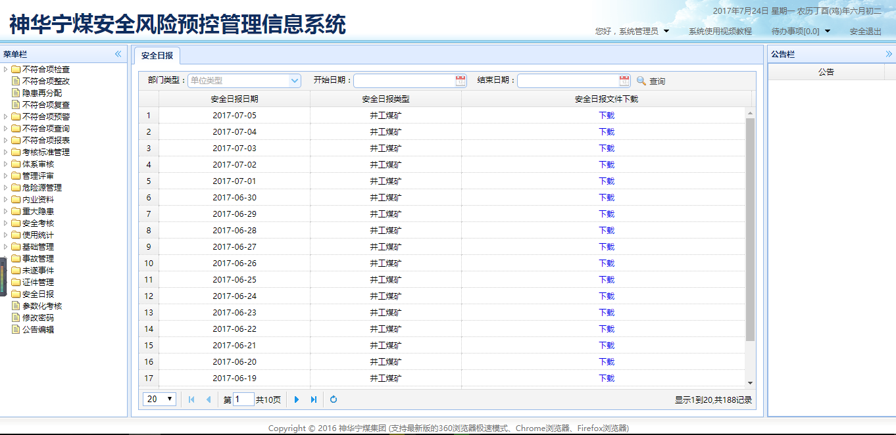

- **不安全行为录入**：以单位自查动态检查为例，可录入关于本单位的不安全行为人员信息，可添加附件。
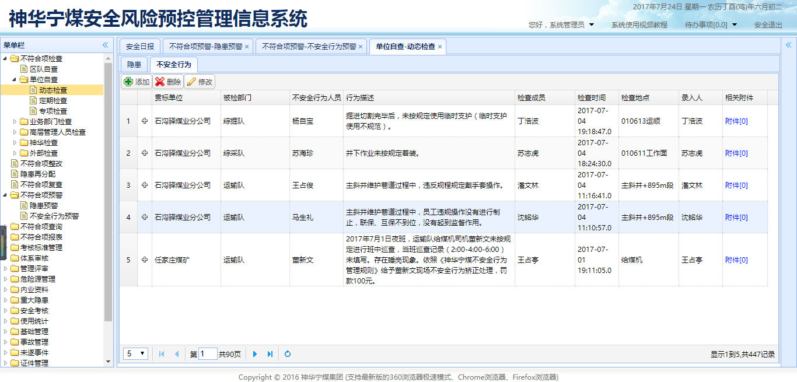
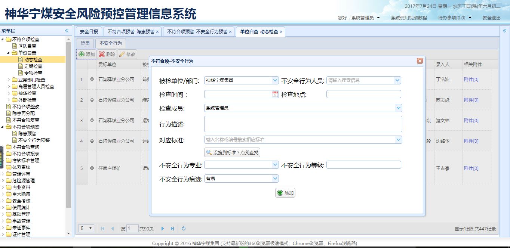

- **隐患预警**：可根据不同条件查询自己权限所属部门的超期隐患，并且根据程度给予不同的颜色显示，可导出所查询数据。
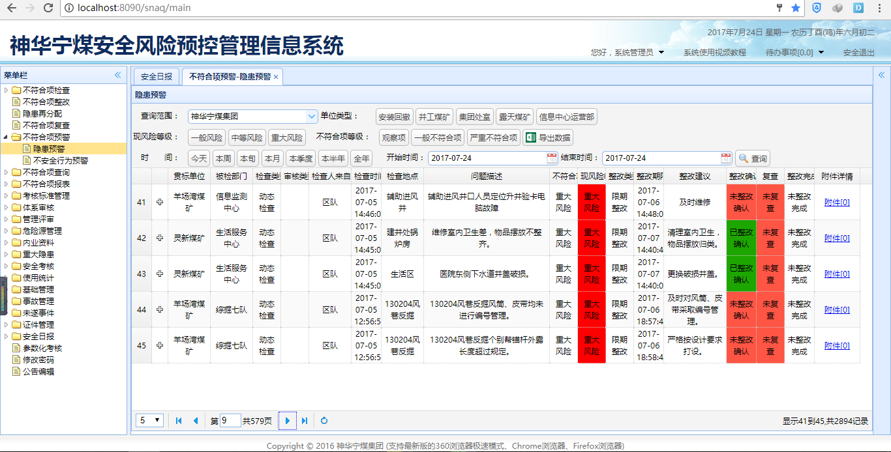

- **不安全行为预警**：查询自己权限所属部门的隐患，根据时间和单位类型查询，根据行为的风险程度不同给予不同颜色的显示，可查看详情。
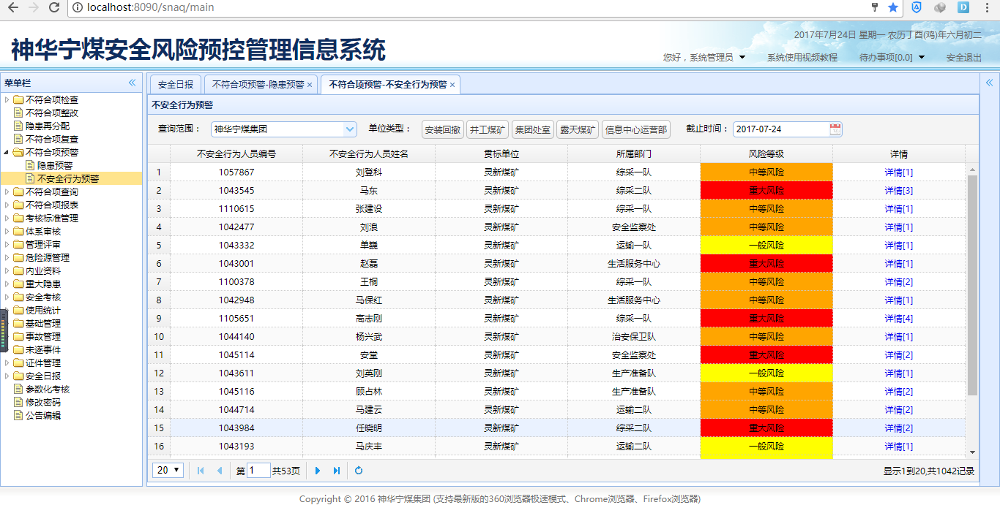

- **隐患查询**：可根据部门、检查人、被检部门、单位类型等组合查询隐患，展开下拉框可根据更多不同条件查询，并且导出数据。
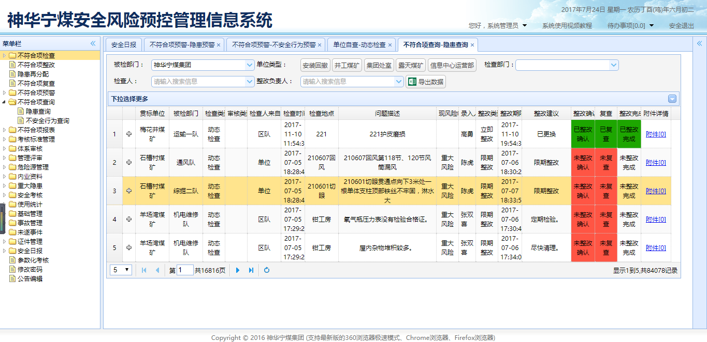

- **不安全行为查询**：可根据被检部门、检查类型、标准和时间来查询数据，可导出已查询的数据。
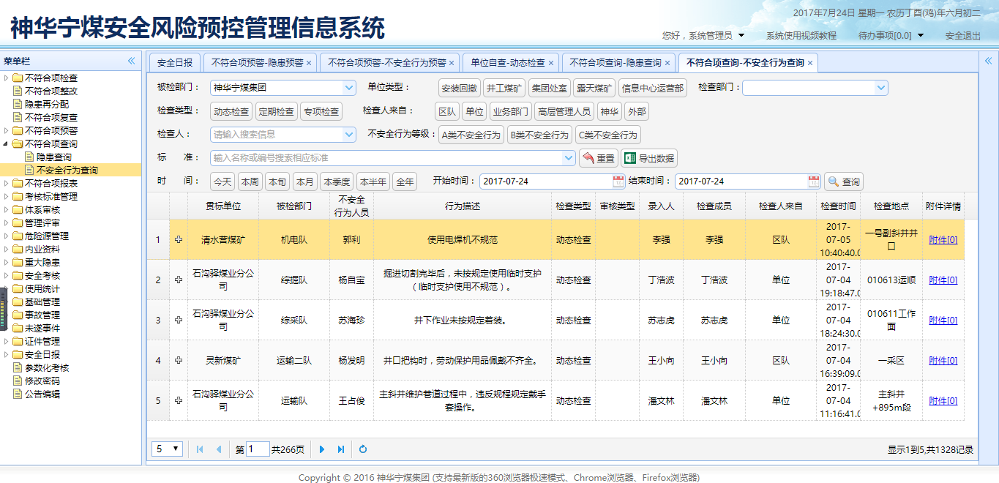

- **管理对象**：根据部门类型父级管理对象查询管理对象，并且可添加、修改、删除、导入、导出管理对象和导入导出管理对象危险源关联，点击对应的危险源可查看对应的危险源
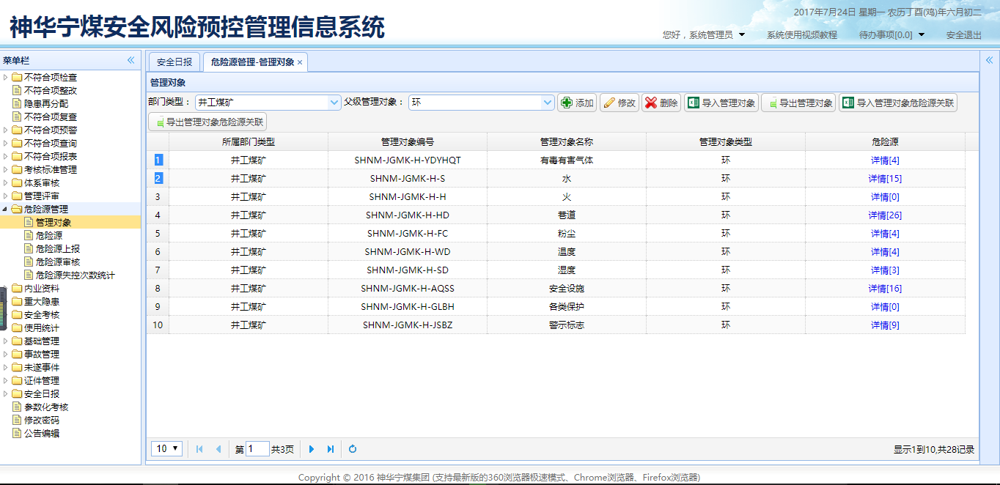
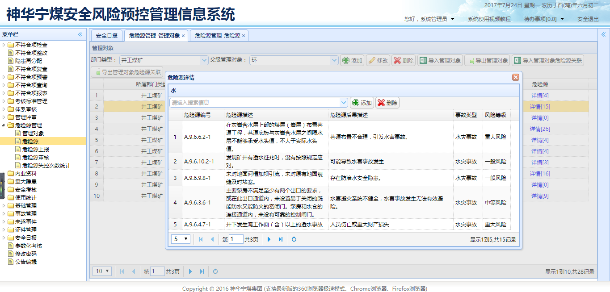

- **危险源**：根据部门类型查询危险源，并且可根据危险源名称或编号、管理对象名称或编号查找危险源，添加、修改、删除危险源，导入导出危险源管理对象关联和危险源指标关联，点击对应的管理对象名称和指标可查看具体的详情。
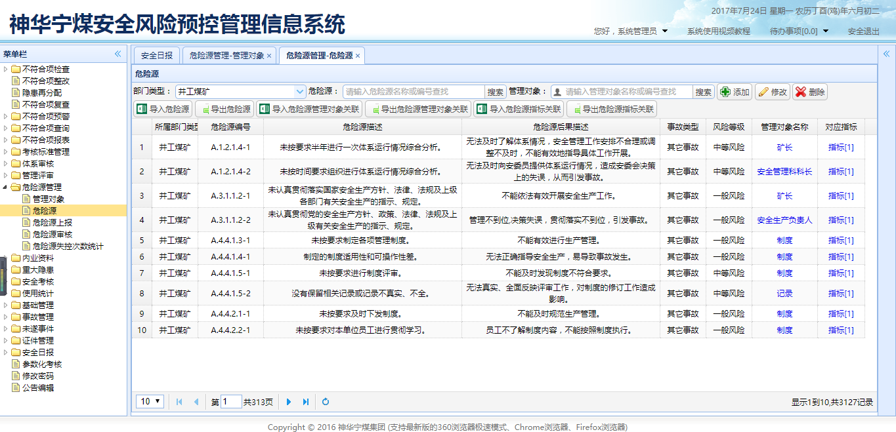
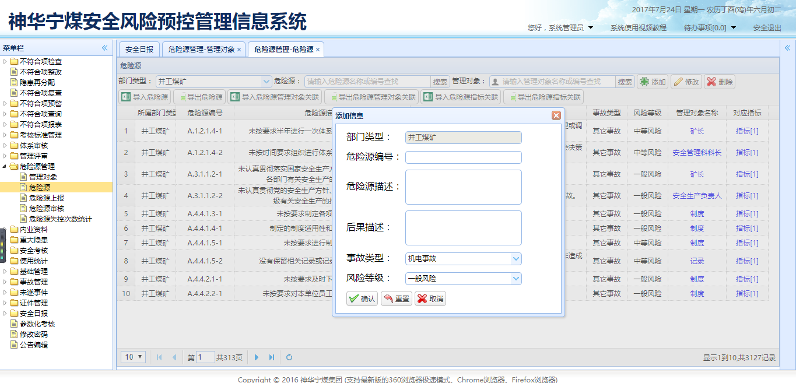

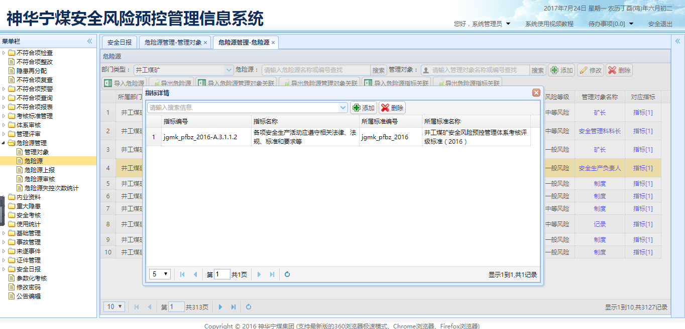
